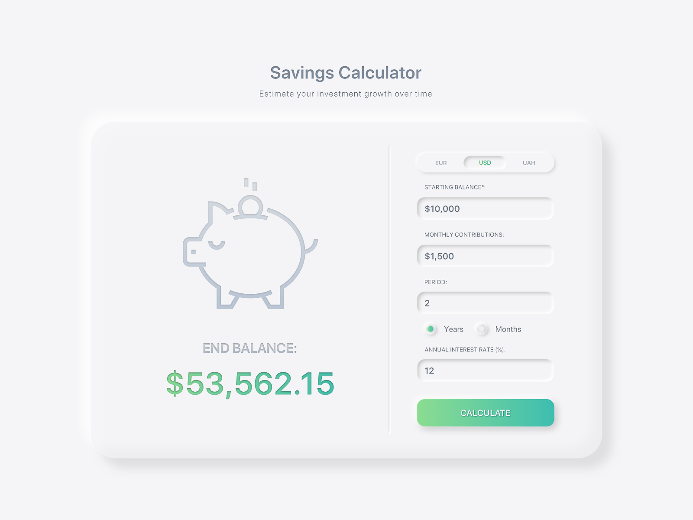

# React Saving Calculator

Saving Calculator App

### Project’s idea

The design was taken from Dribble and created by [Mariana Konstantinova](https://dribbble.com/Maryana_Kons)



### How to use it in local ?

1. Clone the project
2. Install dependencies

```
npm install
```

3. Run the project

```
npm start
```

### Stack

      * React JSX
      * Javascript ES6+
      * Sass

### Author

Written by me
